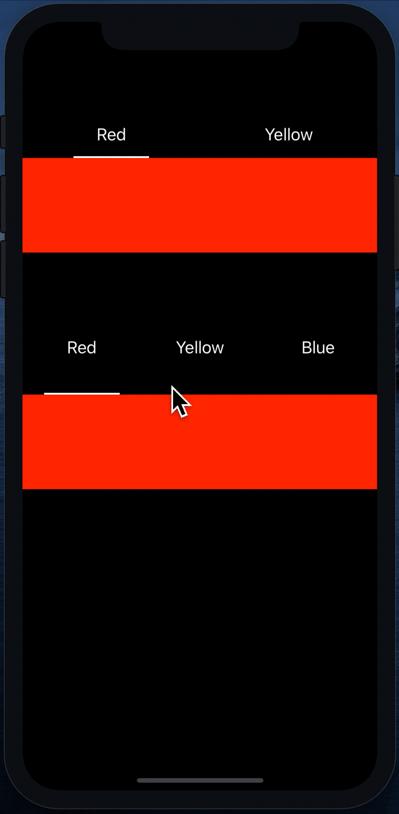

# DI Part 1 - Delegate

### Assignment
請設計一個 Class 名為 `SelectionView`，其所擁有的功能如下：

1. `SelectionView` 可以提供類似 Button 的效果，讓使用者可以與 `SelectionView` 互動；當點選了某一個選項的時候，底下的 `IndicatorView` 會移動到使用者點選的選項下方。

2. 想要使用 `SelectionView` 的 ViewController, 只要執行以下步驟，就可以擁有一個可以使用的畫面:
   * Create 一個 `SeletionView` 的 Instance，並將它加到畫面上。
   * ViewController Conform SelectionDataSource 還有 SelectionViewDelegate。
   * ViewController 將自己 assign 到 `SelectionView` **dataSource** 還有 **delegate** 變數中，讓 SelectionView 可以正常運作。

**SelectionView DataSource** 可以控制：

1. 總共有幾個選項，預設為兩個
2. 每個選項上面的文字
3. 底線的顏色，預設為藍色
4. 選項文字的顏色，預設為白色
5. 選項文字的 Font，預設為 `UIFont.systemFont(ofSize: 18)`

**SelectionView Delegate** 可以控制：

要特別注意的是，以下兩個事件要設計成 **Optional** 的，亦即 conform protocol 的 class 要不要實作都沒關係：

1. 使用者選擇了哪一個選項。
2. 控制使用者是否可以選擇某一個選項，當不能選擇的時候，`IndicatorView` 不會移動，使用者選擇選項的 `Delegate method` 也**不會被觸發**。

### Result

如果成功地完成了 `SelectionView`，可以利用這個 `SelectionView` 完成下列的 App

1. 上下各有一個 SelectionView，一個有兩個選項，一個有三個選項。
2. 點選 SelectionView 內的選項，底下有一個 View 會跟著變色。
3. 如果上方的 SelectionView 目前選取的 button 是最後一個，那下方的 SelectionView 則不可以被使用者控制。



# Recap

當你完成了這份作業，你應該對底下的問題或敘述有一點想法：
1. 為什麼需要在 `delegate` variable 前面加上 `weak`

2. 為什麼需要在 protocol 後面加上 conform `AnyObject`

```swift
protocol SelectionViewDataSource: AnyObject {

}

protocol SelectionViewDelegate: AnyObject {

}
```

3. 如何宣告一個 `Optional` 的 protocol method.

4. Protocol Extension 的功能是給予 protocol 一個 default 的 implemetation，當 conform 的 class 或 struct 沒有 implement 某個 method 的時候，iOS 就會使用在 Protocol Extension 裡面所寫的 method。也就是說，有在 Protocol Extension 裡面 Implementation 的 method，confrom protocol 的 instance 不一定要實作，類似 Optional method 的效果。

5. Protocl Extension 與 Protocol Optional Method 有什麼不同？

6. `Delegate Pattern` 其實是雙向的，過往我們習慣的用法是 **透過 delegate method 的 parameter 將資料由 View 或是 Model 傳送到 Controller**，但 Delegate Method 的 `return value` 是可以 **讓 Controller 傳 value 回到 View 或是 Model 裡面**。

7. 為什麼在 protocol 裡面的 method，前面需要帶上 SelectionView？

```swift
@objc protocol SelectionViewDelegate: AnyObject {

    @objc optional func didSelectedButton(_ selectionView: SelectionView, at index: Int)

    @objc optional func shouldSelectedButton(_ selectionView: SelectionView, at index: Int) -> Bool
}
```

8. 如何做動畫

9. 應該要以物件的角度去設計 App，當我們的資料分散在不同的 Array 時，我們應該要把這些資料，整合起來，最後變成一個裡面是 Object 的 Array。
**讓相關聯的資料，整合成一個物件，用物件的角度去描述事情，是物件導向最基本的概念**。

**Not Preferred**

```swift
let topColor = [UIColor.red, UIColor.yellow]

let topTitle = ["Red", "Yellow"]

let bottomColor = [UIColor.red, UIColor.yellow, UIColor.blue]

let bottomTitle = ["Red", "Yellow", "Blue"]
```

**Preferred**

```swift

struct ButtonModel {

    let color: UIColor

    let title: String
}

let topSource = [
    ButtonModel(color: .red, title: "Red"),
    ButtonModel(color: .yellow, title: "Yellow")
]

let bottomSource = [
    ButtonModel(color: .red, title: "Red"),
    ButtonModel(color: .yellow, title: "Yellow"),
    ButtonModel(color: .blue, title: "Blue")
]

```
